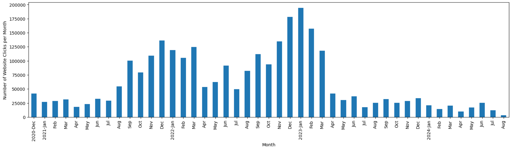

# Bullet Shaping and Iteration Tool

## :exclamation: August 2024 Update

As of 11 August, I am longer working for the Air Force! 

I have no plans to shut down or increase/decrease my level of support for the site, but just wanted to make any remaining users of this site aware. The only thing I am shutting down is my analytics backend in AWS that was costing me a few dollars a month. Here is a final plot of my website visit counts:

Thank you all for the support over the past few years! 

## pdf analysis of air force forms

One of the most pointless and time-consuming things that Air Force officer and enlisted personnel do every year is bullet-writing. 

Air Force personnel typically are required to write bullets for performance reports and award packages. 

AF bullets follow a few formatting rules:

- Each bullet must be exactly one line, with the width of the line depending on the form (performance report, award package, etc).
- Acronyms and abbreviations are organization/commander-specific. Organizations are highly inconsistent with their abbreviation/acronym policies.

Those formatting rules lead to the following

- Information compression is prioritized over legibility
- Time is wasted on acronym/abbreviation revision
- Bullet "appearance" becomes highly valued; some examples of arbitrary bullet appearance rules:
  - any sort of repetition = bad
  - bullets near flush with page boundaries = good

The purpose of this repository is to develop a set of tools to automate the pointless aspects of bullet-writing so that an officer/enlisted member can focus more on writing actual content rather than worry about irrelevant formatting.

Note: When importing rules from a .xlsx file, the columns are:
1. Enabled (TRUE|FALSE)
2. Word (long form)
3. Abbreviation

*VERY IMPORTANT*: Sort the Excel sheet in DESCENDING ORDER.  Due to the greedy nature of the replacement, the reverse sorted order is required to ensure proper compression of abbreviations.  

Example of the bug above: acronyms in sorted order:  
United States Air Force: USAF  
United States Air Force Academy: USAFA  
Will cause "United States Air Force Academy" to be abbreviated as "USAF Academy"  

Reversing the order:   
United States Air Force Academy: USAFA  
United States Air Force: USAF  
Corrects this issue.  
